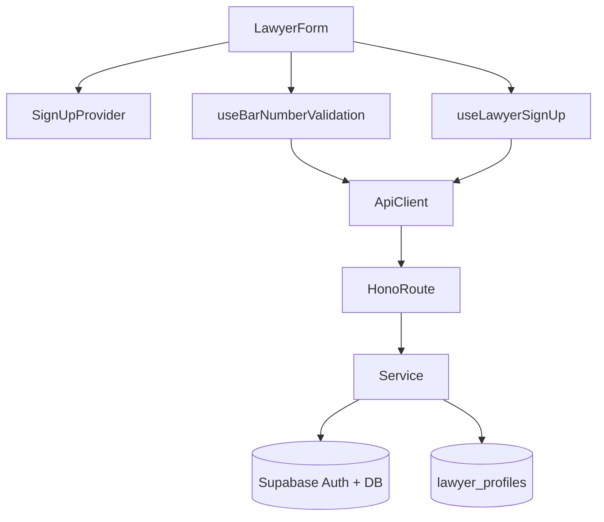

# 02. 변호사 회원 가입 — Implementation Plan

## Overview
- **Shared SignUpProvider 확장 (`src/features/signup/context/sign-up-reducer.ts`)**: 변호사 필드(`formValues.lawyer`, `barNumberLookup`, `postSubmitHintVisible`)를 reducer에 추가하고 Context selector를 정리.
- **Bar Number Validation Hook (`src/features/signup/hooks/use-bar-number-validation.ts`)**: 등록번호 패턴 검사 + 서버 중복 조회를 debounce로 처리하는 커스텀 훅.
- **LawyerSignUpForm Component (`src/features/signup/components/lawyer-sign-up-form.tsx`)**: 변호사 탭 UI, 등록번호 Lookup, 성공 후 안내 배너.
- **Lawyer Sign-up Mutation (`src/features/signup/hooks/use-lawyer-sign-up.ts`)**: `/api/auth/sign-up`에 `type='lawyer'` payload를 보내고 `lawyer_profiles` 초기 데이터를 처리.
- **Backend Service 확장 (`src/features/signup/backend/service.ts`)**: `lawyer` 타입일 때 `lawyer_profiles`, `bar_registration_number` 저장과 기본 `verification_status='pending'` 적용.

## Diagram

## Implementation Plan
### 1. Reducer 확장
1. `SignUpState`에 `formValues.lawyer`, `touched.lawyer`, `fieldErrors.lawyer`, `submitStatus.lawyer`, `barNumberLookup`, `postSubmitHintVisible` 추가.
2. 액션: `REQUEST_BAR_CHECK`, `BAR_CHECK_SUCCESS/FAILURE`, `DISMISS_HINT`. `sign-up-reducer.ts`에서 switch-case 또는 map 구조로 구현.
3. `useSignUpContext`에 `selectLawyerState()` helper를 추가해 폼 전용 selector를 노출해 re-render 최소화.
- **단위 테스트**: reducer 테스트에 변호사 케이스 추가. TDD 단계: (Red) `REQUEST_BAR_CHECK` 후 상태가 `checking`이 되는지 검증하는 failing test → (Green) 최소 구현 → (Refactor) 액션 핸들러 분리.
- **충돌 검토**: 기존 일반 가입 state와 병합되므로 action type 충돌 주의. 새 액션 이름은 중복되지 않도록 `LAWYER/` prefix를 고려.

### 2. useBarNumberValidation Hook
1. `"use client"` 파일, `useEffect + useDebounce`(`react-use`의 `useDebounce` 권장)로 입력 변화를 감시.
2. 패턴 검사: `/^\d{2}-\d{5}$/` 같은 정책을 `src/features/signup/constants/patterns.ts`에 선언.
3. 서버 검사: `apiClient.get('/api/auth/bar-number?value=...')` 임시 엔드포인트 구현(같은 feature backend에서 지원). 응답에 따라 `BAR_CHECK_SUCCESS/FAILURE` dispatch.
4. `useCallback`으로 테스트 가능하도록 HTTP 호출 함수를 분리.
- **단위 테스트**: HTTP helper를 Vitest로 mock, 성공/중복/형식오류 케이스에 대해 Red→Green→Refactor. Hook 자체는 integration test에서 `@testing-library/react` + `vitest`로 시뮬레이트.
- **충돌 검토**: 새 GET 라우트(`/api/auth/bar-number`)는 기존 라우트와 네임스페이스 공유하지만 메서드와 path가 달라 충돌 없음.

### 3. LawyerSignUpForm Component
1. 위치: `src/features/signup/components/lawyer-sign-up-form.tsx`; Context selector를 사용해 입력을 Controlled component로 연결.
2. 등록번호 입력 시 `onBlur`에서 `requestBarNumberCheck` 호출, 진행 중에는 spinner.
3. 제출 버튼은 `policySnapshot.balance` 등 불필요한 필드는 숨기고 `submitLawyerForm`을 실행.
4. 성공 후 `postSubmitHintVisible`이 true일 때 상단 배너(Shadcn `Alert`) 출력 후 `/my-page`로 router push.
- **QA 시트**:
  | 시나리오 | 절차 | 기대 결과 |
  | --- | --- | --- |
  | 등록번호 포맷 오류 | `123` 입력 후 blur | `BAR_CHECK_FAILURE` → 인풋 에러 copy, CTA disable |
  | 등록번호 중복 | 서버가 `409` return | 배너 + Tooltip에 "이미 등록된 변호사" 표시 |
  | 성공 후 안내 | 성공 응답 mock | `postSubmitHintVisible=true`, `"서류를 업로드하세요"` 메시지와 `/my-page` 이동 |
  | 약관 미동의 | 체크 해제 상태에서 submit | Warning copy + CTA disabled |
- **충돌 검토**: Form은 기존 `SignUpPage` 내 새 탭으로 렌더. 컴포넌트 파일명이 고유하여 충돌 없음.

### 4. Lawyer Sign-up Mutation Hook
1. `useLawyerSignUp`에서 `SignUpRequestSchema`를 확장한 `LawyerSignUpRequestSchema` 사용 (`fullName`, `barNumber`).
2. `useMutation` 성공 시 `postSubmitHintVisible` true dispatch, redirect 대상은 `/my-page`.
3. 실패 코드 `BAR_NUMBER_TAKEN`, `INVALID_BAR_NUMBER`를 ui-friendly 메시지로 매핑.
4. Supabase 세션 발급 후 `useRouter().replace('/my-page')`.
- **테스트**: helper 함수 `postLawyerSignUp`에 대한 Vitest (중복 바넘버 → 적절한 에러). Hook은 `@testing-library/react-hooks`로 happy path 검증.
- **충돌 검토**: 같은 endpoint를 재사용하므로 body에 `type:'lawyer'`를 포함하는 것 외엔 기존 로직 변화 없음. 서버도 같은 서비스에서 분기 처리.

### 5. Backend Service 확장
1. `service.ts` 내 `executeSignUp(payload)`에서 `payload.type`에 따라 분기: `user` → 기존 로직, `lawyer` → `lawyer_profiles` INSERT 및 `lawyer_profiles.verification_status='pending'` 기본값.
2. 변호사용 validations: `bar_registration_number` unique 여부 확인 (`.select(...).eq('bar_registration_number', value)`), 존재 시 409 에러 반환.
3. 성공 응답에 `redirectTo: '/my-page'`를 포함, 프론트에서 router push에 활용.
4. 새 GET route `/api/auth/bar-number`에서 uniqueness 체크만 수행; `Supabase` read-only 쿼리.
- **단위 테스트**: `service.test.ts`에 변호사 브랜치 케이스 추가. 시나리오: (1) 바넘버 중복 → 409; (2) lawyer_profiles 삽입 실패 시 전체 롤백. 테스트마다 Red→Green→Refactor 수행.
- **충돌 검토**: Supabase 스키마는 이미 `lawyer_profiles` 테이블 정의가 있으므로 추가 migration 불필요. 기존 auth signup 로직에 영향이 없도록 타입 분기를 철저히 테스트.

### 테스트 & E2E 전략
- **Unit**: reducer, validation hook helper, backend service, bar-number GET route 모두 Vitest 스위트 추가.
- **E2E**: `tests/e2e/signup-lawyer.spec.ts`
  1. 승인되지 않은 변호사가 `/signup?type=lawyer` 방문.
  2. 등록번호 + 실명 입력 → 제출.
  3. 성공 후 `/my-page` 이동 & 인증 업로드 CTA 노출 확인.
  4. 중복 등록번호 케이스.
- **TDD 준수**: 각 유닛 테스트 파일 상단에 `// follows Red -> Green -> Refactor (docs/rules/tdd.md)` 주석으로 프로세스 명시하고, 실패 케이스를 먼저 작성 후 구현.
