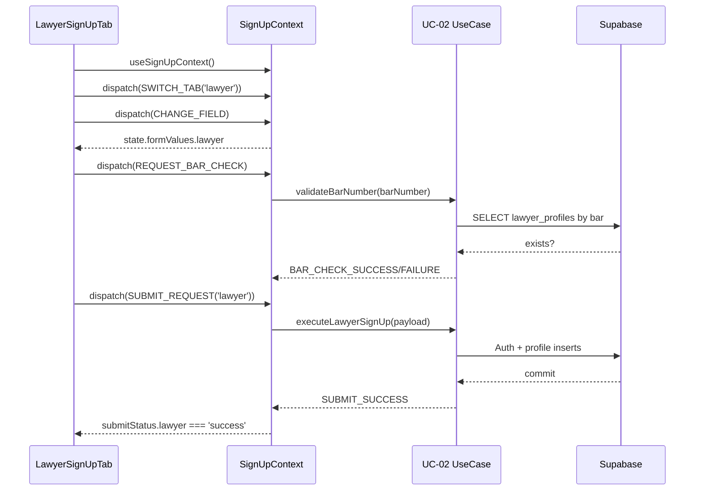

# 02. 변호사 회원 가입 — State Design

## Scope & References
- **Relevant docs**: `docs/requirment.md` (변호사 승인 전 활동 제한), `docs/userflow.md` #2, `docs/usecases/02-lawyer-signup/spec.md`
- **Surface**: `/sign-up?type=lawyer` 탭. `SignUpContext`를 UC-01과 공유하지만 변호사 입력 필드와 제출 플로우가 확장된다.
- **Downstream needs**: `lawyer_profiles` 초기화, `verification_status='pending'`, `/my-page` 리디렉션 안내.

## Managed State Inventory
### Reducer Shape Additions (extends `SignUpState`)
| key | type | description |
| --- | --- | --- |
| `formValues.lawyer` | `{ email, password, confirmPassword, nickname, fullName, barNumber, agreeTerms }` | 변호사 전용 필드 포함.
| `fieldErrors.lawyer` | `Partial<Record<'email' \| 'password' \| 'confirmPassword' \| 'nickname' \| 'fullName' \| 'barNumber' \| 'agreeTerms', string>>` | 실명/등록번호 검증 에러 포함.
| `touched.lawyer` | `Record<string, boolean>` | 입력 blur 여부.
| `submitStatus.lawyer` | `'idle' \| 'validating' \| 'submitting' \| 'success' \| 'error'` | 변호사 탭 CTA 상태.
| `barNumberLookup` | `{ status: 'idle' \| 'checking' \| 'invalid'; suggestion?: string }` | 등록번호 포맷/중복 선검증 결과.
| `postSubmitHintVisible` | `boolean` | 성공 후 "자격 서류 업로드" 안내 배너 토글.

### Display-only / Derived Data
- 변호사 혜택 소개 copy, 단계별 가이드 이미지는 정적 → 상태 제외.
- 등록번호 마스킹 문자열 → `formValues.lawyer.barNumber`를 formatting util로 즉시 계산.
- CTA disable 조건 → 상태 대신 selector(`canSubmitLawyerForm`)에서 계산: 필수값 채움 + `submitStatus.lawyer !== 'submitting'` + `barNumberLookup.status !== 'checking'`.

## State Transition Table
| State slice | Action | Condition | UI impact |
| --- | --- | --- | --- |
| `activeTab` | `SWITCH_TAB('lawyer')` | URL query 또는 탭 클릭 | 탭 헤더/폼 전환, 다른 탭 언마운트 시 값 보존.
| `formValues.lawyer` | `CHANGE_FIELD` | 길이·허용문자 제한, barNumber는 숫자/하이픈만 유지 | 입력 반영, 등록번호 입력 시 자동 포맷.
| `barNumberLookup` | `REQUEST_BAR_CHECK` | 입력 길이 10 이상일 때 debounce 후 호출 | 상태 `checking` → 스피너, CTA disable.
| `barNumberLookup` | `BAR_CHECK_SUCCESS` | API 200 & 미사용 | 스피너 종료, success badge.
| `barNumberLookup` | `BAR_CHECK_FAILURE` | 패턴 불일치 또는 중복 | 에러 문구 표시, submit 차단.
| `submitStatus.lawyer` | `SUBMIT_REQUEST('lawyer')` | 모든 필수값 OK + `barNumberLookup.status !== 'invalid'` | buttons disable, progress overlay.
| same | `SUBMIT_SUCCESS('lawyer')` | BE 커밋 + 세션 발급 성공 | 성공 토스트, `postSubmitHintVisible=true`, `/my-page` 리디렉션 예약.
| same | `SUBMIT_FAILURE` | 오류 발생 | 에러 배너, 에러 필드 focus, CTA 재활성화.
| `postSubmitHintVisible` | `DISMISS_HINT` | 사용자가 배너 닫기 클릭 | 배너 숨김.

## Flux Flow
```mermaid
flowchart LR
  Input[LawyerForm Inputs]
  Action1[CHANGE_FIELD]
  Action2[REQUEST_BAR_CHECK]
  Action3[SUBMIT_REQUEST]
  Store((SignUpReducer))
  View[LawyerTabView]
  UseCase[LawyerSignUpUseCase\n(UC-02)]
  Repo[/Supabase Auth + DB/]

  Input --> Action1 --> Store --> View
  View --> Action2
  Action2 --> Store
  Store -->|effect| BarAPI[validateBarNumber()]
  BarAPI --> Store
  View --> Action3 --> Store --> UseCase --> Repo --> Store
  Store --> View
```

## Context Loading & Exposure
### Flow


### Exposed Interface Additions
- `formValues.lawyer`, `fieldErrors.lawyer`, `touched.lawyer`
- `barNumberLookup`
- `submitLawyerForm()` → wraps validation + UC-02 API call.
- `requestBarNumberCheck(barNumber)` → debounced uniqueness check (shared infra repository `SupabaseLawyerRepository`).
- `postSubmitHintVisible`, `dismissPostSubmitHint()`

> **DRY note**: 동일 Context가 UC-01/UC-02를 모두 다루므로 reducer는 `tab` 파라미터 기반으로 재사용하며, server-error/consent 로직은 공유된다.
