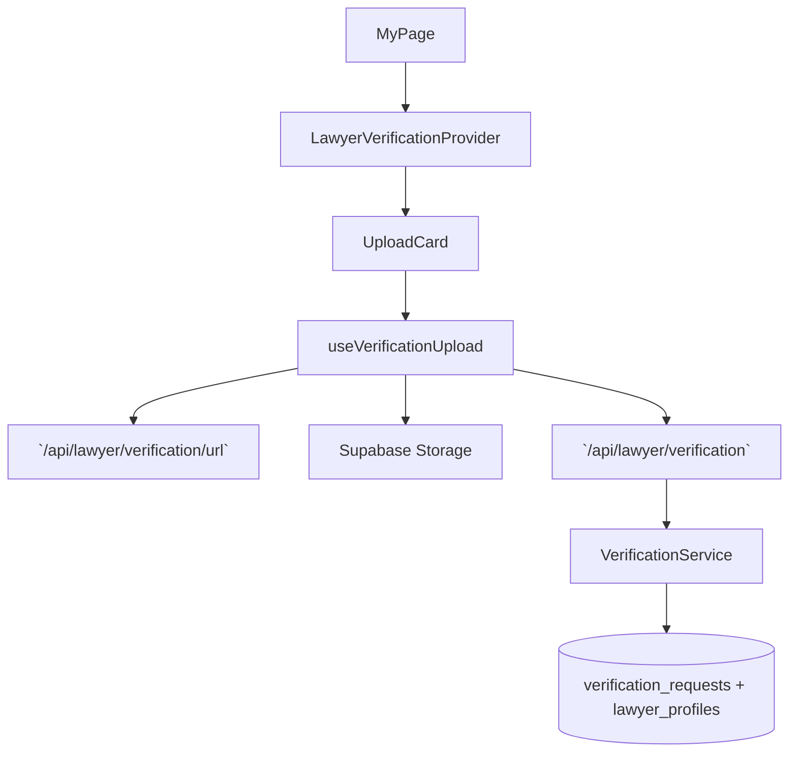

# 03. 변호사 자격 서류 업로드 — Implementation Plan

## Overview
- **LawyerVerificationContext & Reducer (`src/features/lawyer-verification/context/verification-context.tsx`)**: UC-03 state(파일 선택, progress, history, toast)를 관리하는 Provider.
- **useVerificationUpload Hook (`src/features/lawyer-verification/hooks/use-verification-upload.ts`)**: 서명 URL 발급 → 업로드 → persist 단계를 orchestration.
- **VerificationPanel Components (`src/features/lawyer-verification/components/{upload-card,history-list,status-badge}.tsx`)**: Context 상태를 시각화하고 CTA를 제공하는 클라이언트 컴포넌트 묶음.
- **Backend Routes & Service (`src/features/lawyer-verification/backend/{schema,route,service}.ts`)**: `/api/lawyer/verification/url`, `/api/lawyer/verification` 라우트를 정의하고 Supabase Storage + DB 트랜잭션을 수행.
- **Storage Helper (`src/lib/storage/signed-upload.ts`)**: Supabase Storage 사전 서명 URL 요청 로직을 공용 함수로 추출하여 다른 기능에서도 재사용.

## Diagram

## Implementation Plan
### 1. LawyerVerificationContext & Reducer
1. `"use client"` Provider 생성, `useReducer` 초기 상태는 SSR에서 내려주는 `currentStatus`, `history` 값으로 채운다 (`props` via server action).
2. Reducer(`verification-reducer.ts`)는 상태 표에 있는 액션(`FILE_PICKED`, `FILE_INVALID`, `REQUEST_SIGNED_URL`, `SIGNED_URL_SUCCESS/FAILURE`, `UPLOAD_PROGRESS`, `UPLOAD_COMPLETED`, `PERSIST_SUCCESS/FAILURE`, `SHOW_TOAST`, `CLEAR_TOAST`)을 구현.
3. Provider는 `useMemo`로 selector helpers(`isUploadDisabled`, `statusBadgeColor`)를 제공.
- **단위 테스트**: Reducer를 Vitest로 테스트. Red 단계에서 `SIGN_URL_FAILURE` 후 progress reset 여부를 확인하는 실패 테스트 작성 → Green → Refactor. 추가로 `PERSIST_SUCCESS` 시 history prepend 여부 테스트.
- **충돌 검토**: 새 feature 디렉터리가 추가될 뿐 기존 Context들과 namespace 충돌 없음.

### 2. useVerificationUpload Hook
1. 의존성: `@tanstack/react-query` `useMutation` 2개 (signed URL, persist). Hook 내부에서 단계별 dispatch를 호출해 reducer 상태를 갱신.
2. 서명 URL 요청 시 `apiClient.post('/api/lawyer/verification/url', fileMeta)` 사용, 성공 시 URL과 `signedPath`를 반환.
3. 실제 파일 업로드는 `fetch(signedUrl, { method:'PUT' })`로 수행 후 성공 시 persist mutation 호출.
4. Hook은 progress 이벤트를 `XMLHttpRequest`로 수집해 `UPLOAD_PROGRESS` 디스패치.
- **단위 테스트**: HTTP 호출을 helper 함수(`uploadFileWithSignedUrl`)로 분리하여 Vitest로 네트워크 mock. 실패 케이스(서명 URL 403, Storage 500)를 먼저 정의.
- **충돌 검토**: Hook은 새 Context에서만 사용하므로 다른 페이지에 부작용 없음.

### 3. VerificationPanel Components
1. `UploadCard`: 파일 드래그 앤 드롭(`src/components/ui/file-upload`) 재사용, validation 오류 시 helper text 노출, ProgressBar는 `uploadProgress` 상태 표시.
2. `HistoryList`: `history` 배열을 렌더, 상태별 Badge 색상을 `currentStatus` 매핑으로 결정.
3. `StatusBadge`: `currentStatus`에 맞는 copy/아이콘 렌더.
4. Skeleton 및 Empty state를 shadcn components로 구성.
- **QA 시트**:
  | 시나리오 | 절차 | 기대 결과 |
  | --- | --- | --- |
  | 허용되지 않은 파일 | `.gif` 업로드 | `validationErrors.type`, CTA disabled |
  | 업로드 중 취소 | XHR abort 호출 | Progress reset, 토스트에 "업로드가 취소되었습니다" |
  | 성공 후 상태 전환 | 성공 mock | 현재 상태 배지 `in_review`, history prepend |
  | 이미 in_review 상태 진입 | Provider init에서 `currentStatus='in_review'` | Upload CTA 비활성화, 안내 copy |
- **충돌 검토**: UI 컴포넌트 네이밍이 고유, 기존 마이페이지 UI 부재로 충돌 없음.

### 4. Backend Routes & Service
1. `schema.ts`: `SignedUrlRequestSchema`, `VerificationPersistSchema` 정의. 파일 크기 제한/확장자 검증 포함.
2. `route.ts`: `app.post('/api/lawyer/verification/url', ...)`, `app.post('/api/lawyer/verification', ...)` 등록. 인증 미들웨어(추후) 적용 가능하도록 TODO 표기.
3. `service.ts`: 
   - URL 요청 → `SupabaseStorageClient.createSignedUploadUrl` 래핑.
   - Persist → 트랜잭션으로 `verification_requests` INSERT + `lawyer_profiles` status 업데이트; 이미 `in_review`면 409 응답.
4. 성공 시 최신 history row payload 반환해 UI에 즉시 반영.
- **단위 테스트**: `service.test.ts`에서 (a) pending → in_review 전환 happy path, (b) already in_review → 409, (c) DB 실패 → rollback. Red→Green→Refactor 엄수.
- **충돌 검토**: 새 라우트 prefix `/api/lawyer/verification`은 기존 라우트와 겹치지 않음. Supabase Storage helper는 공용 위치에 생성돼 다른 기능과 공유 가능.

### 5. Storage Helper
1. `src/lib/storage/signed-upload.ts` 파일을 만들어 `createSignedUploadUrl({ path, contentType, fileSize })` 함수를 제공.
2. 함수 내부에서 Supabase Edge Function이 아닌 REST API 호출(`supabase.storage.from(bucket).createSignedUploadUrl`)을 실행하고 오류 변환.
3. unit test: mock Supabase client로 성공/실패 분기.
- **충돌 검토**: helper 새로 추가, 다른 기능이 아직 사용하지 않으므로 backward compatibility 문제 없음.

### 테스트 & E2E 전략
- **Unit**: reducer, upload helper, backend service, storage helper 모두 Vitest 스위트 마련.
- **E2E**: `tests/e2e/lawyer-verification.spec.ts`
  1. 승인 대기 변호사로 로그인 → `/my-page` 진입.
  2. 허용 파일 업로드 시 progress → 성공 후 상태 배지 업데이트 검증.
  3. 이미 `in_review` 상태일 때 CTA가 비활성화되는지 확인.
- **TDD 적용**: 각 테스트는 `// RED` 주석과 함께 실패 케이스부터 추가. 구현 후 `// GREEN` 주석으로 변경 사항 정리하고, 리팩터링 단계에서 중복 제거.
