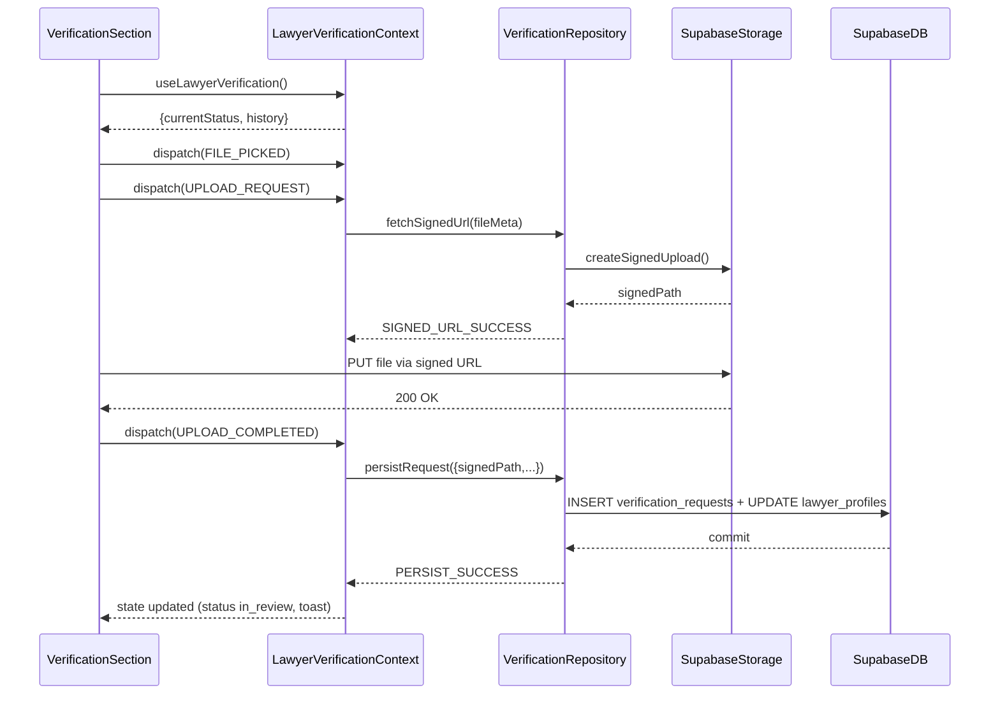

# 03. 변호사 자격 서류 업로드 — State Design

## Scope & References
- **Docs**: `docs/userflow.md` #3, `docs/usecases/03-lawyer-verification-upload/spec.md`, `docs/database.md` (verification_requests, lawyer_profiles), `docs/common-modules.md` (Storage helper).
- **Page**: `/my-page` ▸ 변호사 인증 관리 섹션. `LawyerVerificationContext` (Context + useReducer)로 동일 모듈을 다른 서브컴포넌트(업로드 카드, 히스토리 리스트, 상태 배지)에 공급.

## Managed State Inventory
### Reducer Shape (`VerificationState`)
| key | type | description |
| --- | --- | --- |
| `currentStatus` | `'pending' \| 'in_review' \| 'approved' \| 'rejected'` | `lawyer_profiles.verification_status` snapshot. SSR fetch → reducer init.
| `selectedFile` | `{ name: string; size: number; type: string; signedPath?: string } \| null` | 클라이언트가 선택한 파일 메타.
| `validationErrors` | `{ type?: string; size?: string }` | 확장자/용량 오류.
| `uploadProgress` | `{ percent: number; stage: 'idle' \| 'signing' \| 'uploading' \| 'persisting' }` | Progress bar/CTA disable.
| `requestStatus` | `'idle' \| 'requesting_url' \| 'uploading' \| 'saving' \| 'success' \| 'error'` | 전체 플로우 상태 머신.
| `history` | `VerificationRequest[]` | 최신 제출 내역(정렬된 배열). 비동기 fetch 후 reducer 업데이트.
| `toast` | `{ type: 'success' \| 'error'; message: string } \| null` | 사용자 피드백.

### Display-only / Derived Data
- 파일 업로드 가이드 문구, 허용 확장자 리스트 → 정적 copy.
- CTA disable 여부 → selector `isUploadDisabled = !selectedFile || Object.keys(validationErrors).length > 0 || requestStatus in ['requesting_url','uploading','saving']`.
- 상태 배지 색상 → `currentStatus` to color mapping (pure function).

## State Transition Table
| State slice | Action | Condition | UI impact |
| --- | --- | --- | --- |
| `selectedFile` | `FILE_PICKED(fileMeta)` | 파일 타입/크기 먼저 확인 | 파일 정보 카드 표시, CTA enable.
| `validationErrors` | `FILE_INVALID(reason)` | 확장자 ∉ {jpg,jpeg,png,pdf} 또는 size > limit | 경고 문구 표시, CTA disable.
| `uploadProgress` & `requestStatus` | `REQUEST_SIGNED_URL` | `selectedFile` 존재 | Stage `signing`, progress 5%, 스피너 노출.
| same | `SIGNED_URL_SUCCESS({ signedPath })` | 백엔드 200 응답 | Stage `uploading`, progress 20%.
| same | `SIGNED_URL_FAILURE` | 4xx/5xx | `requestStatus='error'`, 토스트 표시, progress reset.
| same | `UPLOAD_PROGRESS({ percent })` | 브라우저 upload 이벤트 | Progress bar 업데이트.
| same | `UPLOAD_COMPLETED` | Storage 200 | Stage `persisting`, progress 90%, reducer stores `signedPath`.
| `requestStatus` & `history` & `currentStatus` | `PERSIST_SUCCESS({ request })` | `/api/lawyer/verification` POST 성공 | Stage `success`, status `in_review`, 새 히스토리 prepend, 모달 닫힘.
| same | `PERSIST_FAILURE({ message })` | DB 오류 | Stage `error`, progress reset, toast error.
| `toast` | `SHOW_TOAST` / `CLEAR_TOAST` | 필요 시 | Snackbar 제어.

## Flux Flow
```mermaid
flowchart LR
  ActionPick[FILE_PICKED]
  ActionUpload[UPLOAD_REQUEST]
  Store((VerificationReducer))
  View[VerificationPanel]
  API1[GET Signed URL]
  Storage[(Supabase Storage)]
  API2[POST /api/lawyer/verification]

  ActionPick --> Store --> View
  View --> ActionUpload --> Store --> API1 --> Store
  Store --> View
  View -->|put file| Storage --> Store: UPLOAD_COMPLETED
  Store --> API2 --> Store
  Store --> View
```

## Context Loading & Exposure
### Flow


### Exposed Interface (`useLawyerVerification`)
- `state.currentStatus`, `state.history`, `state.uploadProgress`, `state.requestStatus`, `state.validationErrors`, `state.selectedFile`
- Actions:
  - `pickFile(File)`
  - `clearFile()`
  - `startUpload()` → orchestrates signed URL + actual upload + persistence (UC-03)
  - `dismissToast()`
  - `refreshHistory()` → re-fetch latest requests (idempotent GET)

> **Guarantees**: Context provider ensures only one in-flight upload, deduplicates re-submission by ignoring `startUpload` when `requestStatus` is not `'idle'`.
