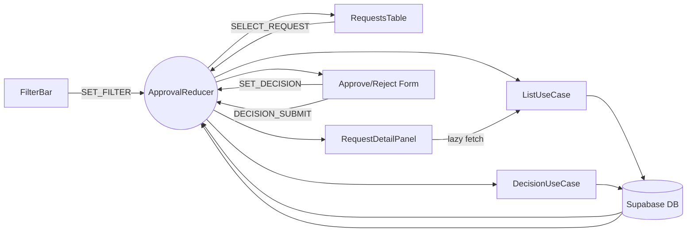

# 04. 관리자 변호사 승인 — State Design

## Scope & References
- **Docs**: `docs/userflow.md` #4, `docs/usecases/04-admin-lawyer-approval/spec.md`, `docs/database.md` (verification_requests, notifications).
- **Page**: `/admin/lawyer-approval`. Only 관리자 접근 (`useRequireRole('admin')`). Context: `LawyerApprovalContext` supplying list, filters, and decision panel state across table/detail components.

## Managed State Inventory
### Reducer Shape (`LawyerApprovalState`)
| key | type | description |
| --- | --- | --- |
| `listStatus` | `'idle' \| 'loading' \| 'success' \| 'error'` | 초기 Fetch & refresh indicator.
| `requests` | `VerificationRequestSummary[]` | 현재 테이블 datasource.
| `cursor` | `{ next?: string; prev?: string }` | pagination 커서.
| `filters` | `{ status: 'in_review' \| 'approved' \| 'rejected'; searchText: string }` | 서버 파라미터.
| `selectedRequestId` | `string \| null` | 상세 패널 오픈 대상.
| `detailCache` | `Record<string, VerificationRequestDetail>` | 요청 상세 정보 메모.
| `decisionDraft` | `{ action: 'approve' \| 'reject' \| null; note: string }` | 버튼 활성/disable 기준.
| `decisionStatus` | `'idle' \| 'submitting' \| 'success' \| 'error'` | 승인/반려 API 호출 상태.
| `toast` | `{ type: 'success' \| 'error'; message: string } \| null` | 글로벌 피드백.

### Display-only / Derived Data
- 테이블 컬럼 정의, 상태 배지 색상, 문서 링크 prefix 등은 상수.
- 승인 건수 요약 = `requests.length` (selector) → 별도 상태 불필요.
- "반려 사유 필수" 검증은 `decisionDraft.action === 'reject'`일 때 note length > 0인지 함수로 계산.

## State Transition Table
| State slice | Action | Condition | UI impact |
| --- | --- | --- | --- |
| `filters` | `SET_FILTER({ status/searchText })` | 입력 debounce 후 dispatch | 테이블 재조회 트리거, URL query sync.
| `listStatus/requests/cursor` | `FETCH_REQUESTS_PENDING` → `FETCH_REQUESTS_SUCCESS/FAILURE` | guard: avoid double fetch when `listStatus==='loading'` | Skeleton 표시 → 테이블 렌더 → 에러 뷰.
| `selectedRequestId` | `SELECT_REQUEST(id)` | id ∈ requests | 상세 패널 open, detail fetch if cache miss.
| `detailCache` | `FETCH_DETAIL_SUCCESS({ id, payload })` | fetch success | 상세 정보(문서 링크, submitted_at) 표시.
| `decisionDraft` | `SET_DECISION({ action?, note? })` | only when `selectedRequestId` | Approve/Reject 버튼 enable/disable, note textarea value.
| `decisionStatus` | `DECISION_SUBMIT_PENDING` | guard: `decisionDraft.action !== null` && reject→note filled | Primary 버튼 스피너, inputs disable.
| `requests` | `DECISION_SUBMIT_SUCCESS({ updatedRequest })` | API 200 | 해당 행 제거 혹은 상태 업데이트, selectedRequest reset, toast success.
| `decisionStatus` | `DECISION_SUBMIT_FAILURE({ message })` | API error | status='error', toast error, buttons re-enabled.
| `toast` | `SHOW_TOAST`/`CLEAR_TOAST` | as needed | Snackbar on/off.

## Flux Flow


## Context Loading & Exposure
### Flow
```mermaid
sequenceDiagram
  participant Page as AdminPage
  participant Guard as useRequireRole('admin')
  participant Ctx as LawyerApprovalContext
  participant Repo as VerificationRequestRepository
  participant DB as Supabase

  Page->>Guard: ensure admin role
  Guard-->>Page: ok
  Page->>Ctx: useLawyerApproval()
  Ctx->>Repo: fetchRequests(filters,cursor)
  Repo->>DB: SELECT verification_requests WHERE status=in_review
  DB-->>Repo: rows
  Repo-->>Ctx: FETCH_REQUESTS_SUCCESS
  Ctx-->>Page: {requests, listStatus}
  Page->>Ctx: dispatch(SELECT_REQUEST)
  Ctx->>Repo: fetchDetail(id)
  Repo->>DB: SELECT ... LIMIT 1
  DB-->>Repo: detail
  Repo-->>Ctx: FETCH_DETAIL_SUCCESS
  Page->>Ctx: dispatch(DECISION_SUBMIT)
  Ctx->>Repo: submitDecision(requestId, action, note)
  Repo->>DB: UPDATE verification_requests & lawyer_profiles; INSERT notification
  DB-->>Repo: commit
  Repo-->>Ctx: DECISION_SUBMIT_SUCCESS
```

### Exposed Interface
- Selectors: `requests`, `listStatus`, `selectedRequest`, `detailCache[selectedId]`, `decisionDraft`, `decisionStatus`, `filters`, `toast`
- Actions:
  - `setFilters(partial)`
  - `goToPage(cursor)`
  - `selectRequest(id)`
  - `setDecisionDraft({ action, note })`
  - `submitDecision()` (UC-04 execution)
  - `refresh()` (refetch list)
  - `dismissToast()`

> **Note**: Table rows automatically drop when `decisionStatus` resolves success. If no rows remain, `listStatus` transitions to `'idle'` and UI shows empty state.
