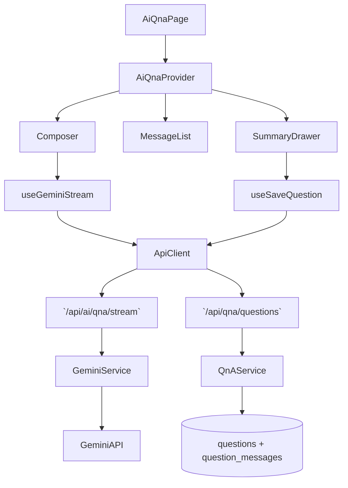

# 05. AI 상담 질문 저장 — Implementation Plan

## Overview
- **AiQnaContext & Reducer (`src/features/ai-qna/context/ai-qna-context.tsx`)**: 채팅 메시지, composer, 스트림 상태, 요약 초안, 저장 상태를 관리하는 Provider.
- **Gemini Stream Hook (`src/features/ai-qna/hooks/use-gemini-stream.ts`)**: `/api/ai/qna/stream` SSE를 호출하여 메시지 chunk를 Context에 반영하고 면책 문구를 강제.
- **SaveQuestion Hook (`src/features/ai-qna/hooks/use-save-question.ts`)**: `messages`, `summaryDraft`, `composer.isPublic`을 서버에 전송하여 `questions`/`question_messages`를 생성.
- **AiQna Page Components (`src/features/ai-qna/components/{chat-message-list,composer,summary-drawer,disclaimer-banner}.tsx`)**: Context 상태 기반 UI를 구성하고 라우터 전환 제어.
- **Backend AI & QnA Routes (`src/features/ai-qna/backend/{schema,route,service}.ts`)**: Gemini proxy(`/api/ai/qna/stream`)와 질문 저장(`/api/qna/questions`) 라우트를 정의, Gemini SDK + Supabase 트랜잭션을 처리.

## Diagram

## Implementation Plan
### 1. AiQnaContext & Reducer
1. `ai-qna-context.tsx`에서 `"use client"` Provider와 reducer(`ai-qna-reducer.ts`)를 정의. 초기 상태는 빈 `messages`, `composer.isPublic=true`.
2. Reducer 액션: `COMPOSER_CHANGE`, `TOGGLE_PUBLIC`, `SEND_MESSAGE`, `STREAM_STARTED`, `STREAM_APPEND_CHUNK`, `STREAM_COMPLETED`, `STREAM_FAILED`, `UPDATE_SUMMARY`, `ACKNOWLEDGE_DISCLAIMER`, `SAVE_REQUEST/SUCCESS/FAILURE`, `CLEAR_ERROR`.
3. Provider는 countdown(`timeline.startAt`)과 파생 selector(`canSend`, `canSave`)를 계산.
- **단위 테스트**: Reducer에 대한 Vitest. 예: `STREAM_APPEND_CHUNK`가 마지막 메시지에 텍스트를 누적하는지(RED: 기대 실패 작성 → GREEN 구현). 또 `SAVE_SUCCESS`가 state reset하는지 검증.
- **충돌 검토**: QnA 관련 Context가 아직 없으므로 신규 추가로 충돌 없음.

### 2. useGeminiStream Hook
1. Hook은 `useCallback`으로 composer 텍스트를 읽고 `/api/ai/qna/stream`에 POST 요청. Response는 `ReadableStream`을 `TextDecoder`로 chunk 처리.
2. chunk마다 `STREAM_APPEND_CHUNK` dispatch, 완료 시 `STREAM_COMPLETED`+ `summaryDraft` 자동 생성.
3. 에러 발생 시 `extractApiErrorMessage`로 메시지를 생성해 `STREAM_FAILED` dispatch.
4. AbortController를 reducer에 저장하여 사용자가 중단 가능하도록 구현.
- **단위 테스트**: streaming 로직을 분리한 `consumeGeminiStream` helper를 Vitest로 테스트(모의 ReadableStream). 실패 케이스(HTTP 500) 먼저 작성.
- **충돌 검토**: 기존 Gemini 연동 없음, `@google/generative-ai` SDK는 backend에서만 사용하므로 hook은 API만 호출.

### 3. SaveQuestion Hook
1. `useSaveQuestion`은 React Query `useMutation`을 사용, payload는 Context에서 전달받은 `messages`, `summaryDraft`, `composer.isPublic`, `disclaimerAcknowledged`.
2. 성공 시 `router.push('/qna/' + questionId)` 호출, 실패 시 에러 배너 dispatch.
3. 요청 body는 `SaveQuestionRequestSchema`(zod)로 검증하여 서버와 공유.
- **단위 테스트**: Helper `postQuestion`를 Vitest로 테스트 (면책 미체크시 422, 성공 201). Hook 자체는 `renderHook` 사용.
- **충돌 검토**: 동일 endpoint를 다른 페이지에서 사용하지 않아 충돌 없음.

### 4. AiQna Page Components
1. `chat-message-list.tsx`: 메시지 버블, 그룹화, AI/사용자 아바타(픽썸 이미지) 렌더.
2. `composer.tsx`: textarea + attachments(추후). `sendMessage` 버튼 disable 조건 = `!state.canSend`.
3. `summary-drawer.tsx`: 저장 전에 제목/태그를 편집할 수 있는 Drawer UI. 저장 버튼 → `saveQuestion` 실행.
4. `disclaimer-banner.tsx`: 면책 체크박스, `disclaimerAcknowledged` 상태 반영.
- **QA 시트**:
  | 시나리오 | 절차 | 기대 결과 |
  | --- | --- | --- |
  | AI 스트림 실패 | API 500 mock | 메시지 리스트에서 pending AI 버블 제거, 에러 토스트 |
  | 공개 토글 | isPublic false로 저장 | 질문 저장 API가 `is_public=false`로 전송 → 성공 후 `/qna/{id}`에서 변호사 CTA 숨김 |
  | 면책 미동의 저장 | checkbox 미체크 후 Save | 저장 버튼 disabled, 안내 copy 표시 |
  | Abort | 스트리밍 중 Stop 버튼 클릭 | AbortController가 fetch 중단, 상태 idle |
- **충돌 검토**: `/ai-qna` 페이지는 신규 UI로, 기존 랜딩 페이지 구성과 분리되어 충돌 없음.

### 5. Backend AI & QnA Routes
1. `schema.ts`: 
   - `GeminiStreamRequestSchema`(messages array, context data).
   - `SaveQuestionRequestSchema`(messages, title, tags, isPublic, disclaimerAcknowledged).
2. `route.ts`: 
   - `app.post('/api/ai/qna/stream', ...)`: Gemini SDK 호출, 면책 문구 강제, 결과를 `ReadableStream`으로 반환.
   - `app.post('/api/qna/questions', ...)`: Supabase 트랜잭션으로 `questions`, `question_messages` INSERT, 타임스탬프 기록.
3. `service.ts`: `storeQuestionWithMessages` 함수로 트랜잭션 캡슐화. `questions` 생성 후 `question_messages` bulk insert.
4. Gemini 호출 시 `AppLogger`로 requestId와 latency 기록.
- **단위 테스트**: `service.test.ts` (DB 트랜잭션 mock) + `gemini-service.test.ts` (SDK mock, 면책 문구 포함 여부). 테스트 순서는 항상 TDD 프로세스 따라 실패 테스트부터.
- **충돌 검토**: 새 라우트 prefix `/api/ai/qna`와 `/api/qna`는 기존과 겹치지 않음. Supabase 스키마(`questions`, `question_messages`)는 이미 정의됨.

### 테스트 & E2E 전략
- **Unit**: reducer, streaming helper, save helper, backend service, Gemini wrapper에 각각 Vitest 스위트 구성.
- **E2E**: `tests/e2e/ai-qna.spec.ts`
  1. 사용자가 Composer에 질문 작성 → AI 응답 스트림 표시 확인.
  2. "변호사에게 공개" 체크 후 Save → 성공 시 `/qna/{id}` 이동 및 질문 카드가 게시판에 노출되는지 확인.
  3. 면책 체크 미완료 케이스.
- **TDD 적용**: 각 단위 테스트 파일 상단에 규칙 주석 추가, 테스트 작성 순서는 항상 Red → Green → Refactor.
