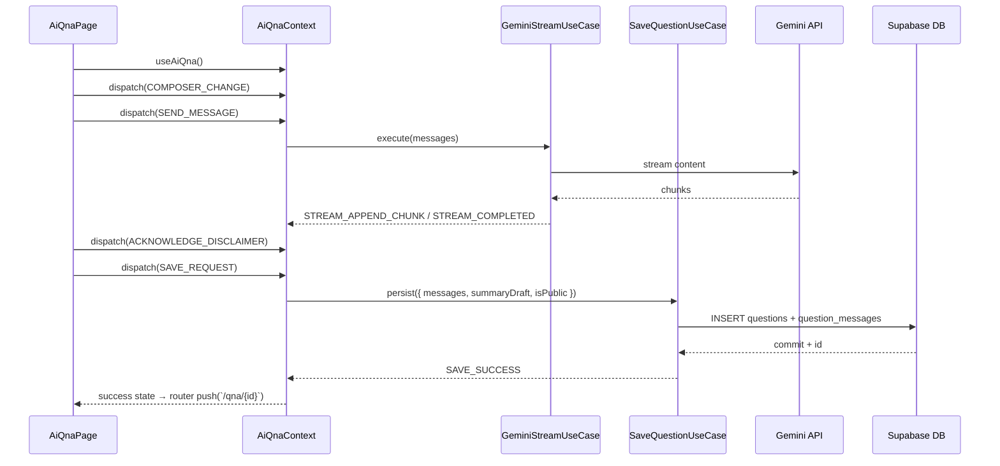

# 05. AI 상담 질문 저장 — State Design

## Scope & References
- **Docs**: `docs/requirment.md` (AI 면책, 공개 옵션), `docs/userflow.md` #5, `docs/usecases/05-ai-question-publication/spec.md`, `docs/database.md` (questions, question_messages).
- **Page**: `/ai-qna`. Shared `AiQnaContext` providing chat state to Composer, MessageList, Toolbar, SummaryDrawer.
- **External**: Gemini streaming API, `/api/qna/questions` persistence endpoint.

## Managed State Inventory
### Reducer Shape (`AiQnaState`)
| key | type | description |
| --- | --- | --- |
| `messages` | `ChatMessage[]` (id, role:'user'\|'ai', content, createdAt, pending:boolean) | 채팅 히스토리 + 진행 중 메시지.
| `composer` | `{ text: string; attachments: File[]; isPublic: boolean }` | 입력창 상태, 공개 여부 토글 포함.
| `stream` | `{ status: 'idle' \| 'sending' \| 'receiving'; abortController?: AbortController }` | Gemini 호출 진행도.
| `error` | `{ type: 'network' \| 'validation' \| 'server'; message: string } \| null` | 현재 에러 배너.
| `summaryDraft` | `{ title: string; tags: string[] }` | 질문 저장 시 사용하는 요약 값.
| `saveStatus` | `'idle' \| 'saving' \| 'success' \| 'error'` | 질문 저장 CTA 상태.
| `disclaimerAcknowledged` | `boolean` | 면책 문구 체크 여부. 저장 버튼 guard.
| `timeline` | `{ startAt: number; lastUserMessageAt?: number }` | 삭제 가능 시간 계산에 사용 (derived for future pages).

### Display-only / Derived Data
- 면책 문구 본문, FAQ 링크 → 정적.
- 메시지 버블 스타일, 연속 role 합치기 → `messages` selector로 계산.
- 삭제 가능 타이머, 공개 여부 안내 → `Date.now() - timeline.lastUserMessageAt`로 계산.
- Gemini 사용량 배지 → `messages.filter(role='ai').length` count → derived.

## State Transition Table
| State slice | Action | Condition | View impact |
| --- | --- | --- | --- |
| `composer` | `COMPOSER_CHANGE({ text })` | 항상 허용, 길이 2,000자 제한 | 입력값 반영, 글자수 카운터.
| `composer.isPublic` | `TOGGLE_PUBLIC()` | none | 체크박스 상태, 공개 툴팁 copy 업데이트.
| `stream` & `messages` | `SEND_MESSAGE()` | guard: `composer.text.trim().length > 0`, `stream.status === 'idle'` | 사용자 메시지를 `pending=false`로 push, 입력창 reset, 로딩 인디케이터 표시.
| same | `STREAM_STARTED({ controller })` | usecase dispatch | `stream.status='sending'`, stop button 활성화.
| same | `STREAM_APPEND_CHUNK(text)` | Gemini chunk 수신 | 마지막 AI 메시지 content append, typing indicator.
| same | `STREAM_COMPLETED` | Gemini finish | `stream.status='idle'`, AI 메시지 확정, summaryDraft auto-fill(첫 60자).
| same | `STREAM_FAILED({ message })` | API 오류 | `error` 세팅, 마지막 AI 임시 메세지 제거, `stream.status='idle'`.
| `summaryDraft` | `UPDATE_SUMMARY({ title, tags })` | 사용자가 수동 수정 | 저장 모달 preview 업데이트.
| `saveStatus` | `SAVE_REQUEST()` | guard: `disclaimerAcknowledged && messages.length > 0` | 저장 모달 CTA 스피너, 화면 dim.
| same | `SAVE_SUCCESS({ questionId })` | API 200 | 성공 토스트, router push(`/qna/{id}`) promise, state reset(keep history?).
| same | `SAVE_FAILURE({ message })` | API error | 에러 배너, CTA enable, retry link.
| `disclaimerAcknowledged` | `ACKNOWLEDGE_DISCLAIMER(boolean)` | toggled by checkbox | 저장 버튼 enable/disable.
| `error` | `CLEAR_ERROR` | after toast dismiss | Banner hide.

## Flux Flow
```mermaid
flowchart LR
  Composer[Composer] -->|COMPOSER_CHANGE| Store((AiQnaReducer))
  Composer -->|SEND_MESSAGE| Store
  Store --> GeminiCall[Gemini Stream UseCase]\n(`/api/ai/qna/stream`)
  GeminiCall --> Store
  Store --> MessagesView[ChatMessageList]
  SummaryDrawer -->|UPDATE_SUMMARY| Store
  SaveButton -->|SAVE_REQUEST| Store --> PersistUseCase[SaveQuestion UseCase]\n(`/api/qna/questions`)
  PersistUseCase --> Store --> Router
```

## Context Loading & Exposure
### Flow


### Exposed Interface (`useAiQna`)
- State: `messages`, `composer`, `stream.status`, `error`, `summaryDraft`, `saveStatus`, `disclaimerAcknowledged`
- Actions/Helpers:
  - `updateComposer(value)`
  - `togglePublic()`
  - `sendMessage()`
  - `abortStream()`
  - `updateSummary(partial)`
  - `acknowledgeDisclaimer(bool)`
  - `saveQuestion()`
  - `clearError()`
  - `replaySession()` (optional: reload from draft)

> **Design note**: Context ensures `messages` remains the single source of truth for both AI streaming UI and question persistence to keep deletion countdown consistent across `/qna/{id}` pages.
