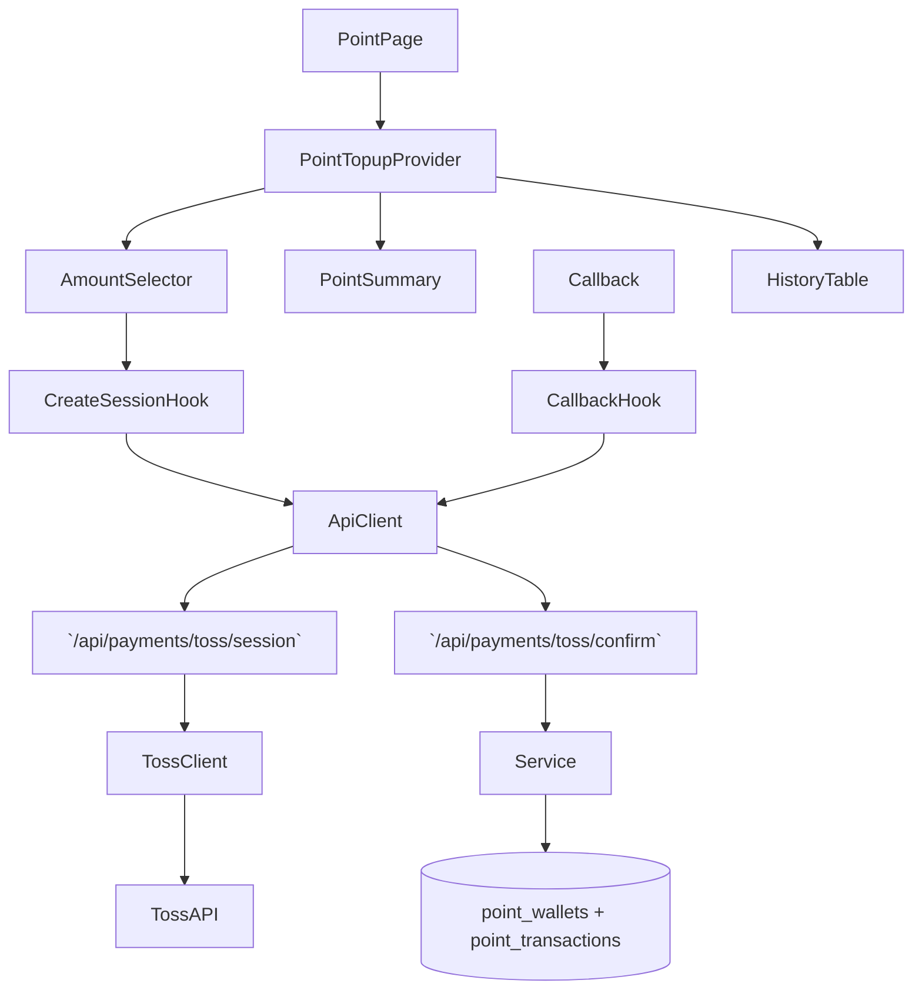

# 06. 변호사 포인트 충전 — Implementation Plan

## Overview
- **PointTopupContext & Reducer (`src/features/point-topup/context/point-topup-context.tsx`)**: 잔액, 금액 입력, 세션 상태, 콜백 상태, 히스토리를 전역으로 관리.
- **CreateSession Hook (`src/features/point-topup/hooks/use-create-toss-session.ts`)**: 금액 검증 → `/api/payments/toss/session` 요청 → redirect 흐름을 캡슐화.
- **Callback Handler Hook (`src/features/point-topup/hooks/use-topup-callback.ts`)**: 결제 성공 리디렉션 파라미터를 파싱하고 `/api/payments/toss/confirm` 호출 후 Context 업데이트.
- **UI Components (`src/features/point-topup/components/{point-summary,amount-selector,history-table,status-banner}.tsx`)**: 상태를 시각화하면서 CTA를 제공.
- **Payment Backend (`src/features/point-topup/backend/{schema,route,service,toss-client}.ts`)**: Toss session 생성, 콜백 검증, Supabase 트랜잭션으로 `point_transactions`, `point_wallets`를 업데이트.

## Diagram

## Implementation Plan
### 1. PointTopupContext & Reducer
1. `point-topup-context.tsx`에 Provider 생성, initial state는 서버에서 주입한 wallet snapshot과 history 데이터를 사용.
2. Reducer(`point-topup-reducer.ts`) 액션: `SELECT_PRESET`, `TYPE_CUSTOM`, `VALIDATION_RESULT`, `CREATE_SESSION_REQUEST/SUCCESS/FAILURE`, `PAYMENT_CALLBACK_PENDING/SUCCESS/FAILURE`, `HISTORY_FETCH_SUCCESS`, `SHOW_TOAST`, `CLEAR_TOAST`.
3. `validation` 로직은 util 함수(`validateAmount`)로 분리하여 단위 테스트 용이하게.
- **단위 테스트**: reducer 테스트에서 (a) preset 선택 시 custom 초기화, (b) callback success 시 balance 갱신을 검증. 실패 케이스부터 작성.
- **충돌 검토**: 새 Context는 마이페이지 하위 섹션에 독립적으로 사용, 기존 상태들과 중복 없음.

### 2. CreateSession Hook
1. 금액은 Context selector를 통해 읽고, `validationError`가 없을 때만 mutation 실행.
2. `useMutation`으로 `/api/payments/toss/session` POST, 응답에는 `paymentKey`, `checkoutUrl` 등 Toss 정보 포함.
3. 성공 시 `window.location.href = redirectUrl`, 동시에 `sessionStatus='redirecting'` dispatch.
- **단위 테스트**: helper `createTossSession`을 Vitest로 테스트 (성공 → redirectUrl, 실패 → 에러 메시지). Hook은 `renderHook`과 `next-router-mock`으로 최소 검증.
- **충돌 검토**: HTTP 경로가 고유, 다른 기능과 충돌 없음.

### 3. Callback Handler Hook
1. `/my-page/points?paymentKey=...&orderId=...` 형태의 리턴 URL에서 파라미터를 읽어 mutation을 실행.
2. `/api/payments/toss/confirm`에 POST → 서비스에서 시그니처 검증 및 잔액 갱신. 성공 시 토스트 + history prepend.
3. Hook은 멱등성을 위해 마지막으로 처리한 `paymentKey`를 ref에 보관.
- **단위 테스트**: helper `confirmTossPayment`를 Vitest로 테스트 (중복 요청 → 409, 성공 → wallet snapshot). Hook은 integration 테스트에서 `URLSearchParams` mocking.
- **충돌 검토**: Callback 위치는 이 섹션 내에서만 사용, 별도 충돌 없음.

### 4. UI Components
1. `PointSummary`: 현재 잔액과 마지막 갱신 시각 표시. 잔액 배지는 React Query data + Context state 동기화.
2. `AmountSelector`: preset 버튼 + custom input. 입력 이벤트는 Context 액션 호출.
3. `HistoryTable`: 최근 `point_transactions`를 테이블로 렌더, pagination 필요시 `load more` 버튼.
4. `StatusBanner`: `sessionStatus`/`callbackStatus` 조합에 따라 안내 copy 표시.
- **QA 시트**:
  | 시나리오 | 절차 | 기대 결과 |
  | --- | --- | --- |
  | 최소 금액 미달 | 5,000 입력 | validation error copy, CTA disabled |
  | 결제 세션 생성 실패 | API 500 mock | Error toast, 상태 idle |
  | 결제 성공 | callback 파라미터 전달 | 잔액 증가, history prepend, success toast |
  | 중복 콜백 | 같은 paymentKey 두 번 전달 | 두 번째 호출 무시, warning toast |
- **충돌 검토**: UI 컴포넌트 명칭 고유, 기존 MyPage UI가 없으므로 안전.

### 5. Payment Backend & Toss Client
1. `toss-client.ts`: Toss API 호출 함수 (`createPaymentSession`, `confirmPayment`). 서명 헤더와 시그니처 검증 로직 포함.
2. `schema.ts`: 
   - `CreateSessionRequestSchema`(amount, redirect URLs).
   - `ConfirmPaymentRequestSchema`(paymentKey, orderId, amount).
3. `service.ts`: 
   - `createSession` → Toss API 호출 후 URL 반환.
   - `confirmPayment` → Toss 검증 → Supabase 트랜잭션: `point_transactions` insert, `point_wallets` update.
4. `route.ts`: `/api/payments/toss/session`, `/api/payments/toss/confirm` 등록. 모든 라우트 path `/api/payment...` prefix 준수.
- **단위 테스트**: `toss-client.test.ts`(시그니처 검증), `service.test.ts`(wallet 업데이트, 중복 처리). 실패 테스트부터 작성해 TDD 준수.
- **충돌 검토**: Toss 관련 env (`TOSS_SECRET_KEY`, `TOSS_CLIENT_KEY`)는 이미 `serverEnv`에 정의되어 있어 추가 설정 불필요. 새 경로는 기존 API와 충돌하지 않음.

### 테스트 & E2E 전략
- **Unit**: reducer, amount validator, session/confirm helpers, backend service, Toss client. 모든 테스트 파일에 TDD 주석 추가.
- **E2E**: `tests/e2e/lawyer-point-topup.spec.ts`
  1. 승인 변호사로 로그인 → 카드를 통해 잔액 확인.
  2. 금액 선택 후 "충전" 클릭 → Toss sandbox 페이지로 이동 확인.
  3. callback stub을 통해 성공 응답 → 잔액 증가 여부 검증.
  4. 결제 취소 플로우.
- **Additional Checks**: React Query 캐시 키 `['pointWallet']`를 invalidate 하여 여러 컴포넌트 간 일관성 확보.
