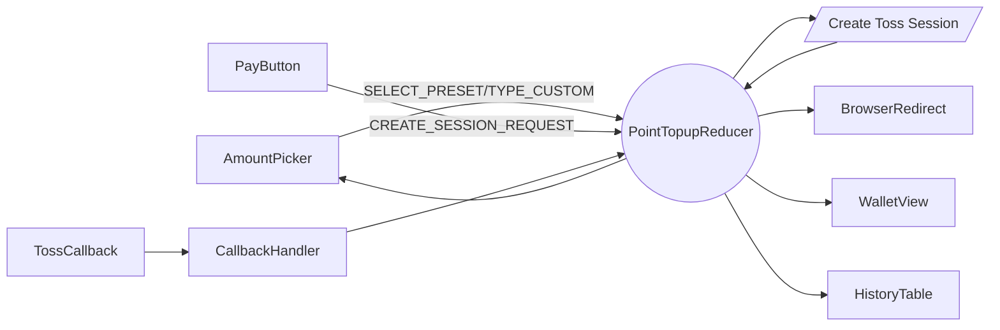
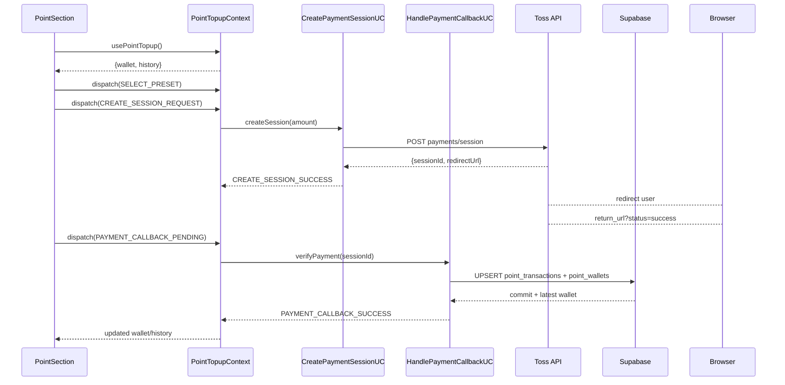

# 06. 변호사 포인트 충전 — State Design

## Scope & References
- **Docs**: `docs/userflow.md` #6, `docs/usecases/06-lawyer-point-topup/spec.md`, `docs/database.md` (point_wallets, point_transactions), `docs/external.md/gemini_api.md` (not needed), Toss API refs per tech stack.
- **Page**: `/my-page` ▸ 포인트 관리 섹션. Context `PointTopupContext` shared between AmountSelector, PaymentHistoryList, StatusBanner.

## Managed State Inventory
### Reducer Shape (`PointTopupState`)
| key | type | description |
| --- | --- | --- |
| `wallet` | `{ balance: number; lastUpdated: string }` | Supabase snapshot. SSR fetch/ SWR refresh.
| `amountInput` | `{ preset?: number; custom?: string }` | 사용자가 선택/입력한 충전 금액.
| `validationError` | `string \| null` | 최소 금액/정수 여부 오류 메시지.
| `sessionStatus` | `'idle' \| 'creating' \| 'redirecting' \| 'awaiting_callback'` | 결제 세션 생성 ~ 콜백 대기.
| `sessionInfo` | `{ sessionId: string; redirectUrl: string } \| null` | Toss 결제창 파라미터.
| `callbackStatus` | `'idle' \| 'verifying' \| 'success' \| 'error'` | Toss success 콜백 처리.
| `history` | `PointTransaction[]` | 최근 충전/차감 내역.
| `toast` | `{ type: 'success' \| 'error'; message: string } \| null`

### Display-only / Derived Data
- 환율 안내, 1포인트=1원 copy → 상수.
- 결제 버튼 disable 조건 = selector `isPayDisabled = sessionStatus === 'creating' || validationError || !amountInputValue`.
- 금액 summary chip = `Number(amountInput.custom ?? preset).toLocaleString()` → derived.

## State Transition Table
| State slice | Action | Guard/Condition | View impact |
| --- | --- | --- | --- |
| `amountInput` | `SELECT_PRESET(amount)` | preset ∈ [10000, 30000, 50000, 100000] | 버튼 active 스타일, custom input cleared.
| same | `TYPE_CUSTOM(value)` | allow only digits | 커스텀 입력 업데이트, validation triggered.
| `validationError` | `VALIDATION_RESULT(error?)` | run after each input change | 에러 helper text, CTA disable.
| `sessionStatus/sessionInfo` | `CREATE_SESSION_REQUEST` | `validationError === null` | CTA spinner, disable inputs.
| same | `CREATE_SESSION_SUCCESS({ sessionId, redirectUrl })` | API 200 | status='redirecting', `sessionInfo` set, window.location = redirectUrl.
| same | `CREATE_SESSION_FAILURE({ message })` | API error | status='idle', toast error.
| `callbackStatus` & `wallet` | `PAYMENT_CALLBACK_PENDING` | triggered via return URL query or webhook poll | show verifying banner.
| same | `PAYMENT_CALLBACK_SUCCESS({ wallet, historyEntry })` | DB update success | Balance chip update, history prepend, toast success, status reset.
| same | `PAYMENT_CALLBACK_FAILURE({ message })` | verification failure | Warning banner, allow retry.
| `history` | `HISTORY_FETCH_SUCCESS(list)` | after mount/pagination | Table render.

## Flux Flow

## Context Loading & Exposure
### Flow

### Exposed Interface (`usePointTopup`)
- `wallet`, `history`, `amountInput`, `validationError`, `sessionStatus`, `callbackStatus`, `toast`
- Actions:
  - `selectPreset(amount)`
  - `typeCustom(value)`
  - `createSession()` (UC-06 start)
  - `handleCallback(params)` (idempotent verification)
  - `refreshHistory()`
  - `dismissToast()`

> **Reliability guards**: Context ignores duplicate `createSession` dispatch while `sessionStatus !== 'idle'`. Callback handler compares `sessionId` to last success to avoid double-credit.
