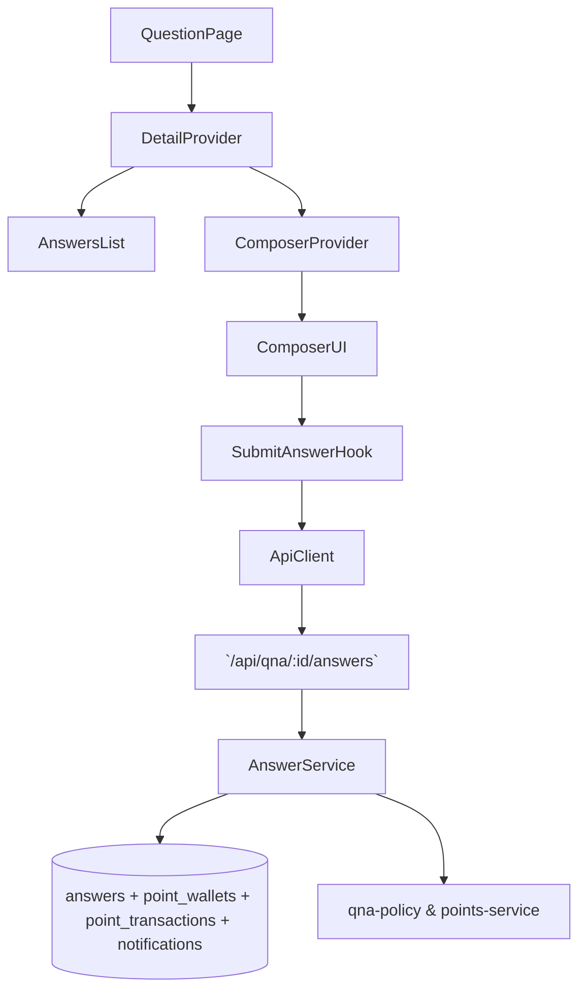

# 07. 변호사 답변 작성 — Implementation Plan

## Overview
- **QuestionDetailContext (`src/features/qna-detail/context/question-detail-context.tsx`)**: 질문, 답변 리스트, 정책 스냅샷을 공유하는 Provider (UC-07/08/09 공용).
- **LawyerAnswerComposerContext (`src/features/qna-detail/context/lawyer-answer-composer.tsx`)**: 답변 작성 전용 상태(초안, 모드, 제출 상태, 토스트)를 관리.
- **SubmitAnswer Hook (`src/features/qna-detail/hooks/use-submit-answer.ts`)**: `/api/qna/{questionId}/answers` 호출과 포인트 잔액 갱신을 캡슐화.
- **Composer Components (`src/features/qna-detail/components/{lawyer-answer-composer,answer-card,policy-banner}.tsx`)**: 에디터 UI, 미리보기, 잔액 정보, policy 경고를 렌더링.
- **Backend Answer Route & Service (`src/features/qna-detail/backend/{schema,route,service}.ts`)**: 질문 유효성, 포인트 차감, 답변 저장, 알림 생성 로직을 구현.

## Diagram

## Implementation Plan
### 1. QuestionDetailContext
1. Server Component(`src/app/qna/[questionId]/page.tsx`)에서 Supabase 데이터를 fetch 후 Provider 초기값으로 전달.
2. Reducer(`question-detail-reducer.ts`)는 질문/답변 업데이트, policy 계산 결과를 저장. 액션: `SET_DATA`, `APPEND_ANSWER`, `UPDATE_ANSWER_STATUS`, `MARK_DELETED`, `UPDATE_POLICY`.
3. Policy 계산은 이미 존재하는 `evaluateQuestionDeletion`, `canAdoptAnswer`, `canSubmitAnswer`를 사용하여 selector로 노출.
- **단위 테스트**: Reducer TDD (예: `APPEND_ANSWER`가 목록 상단에 추가되는지). Policy 계산은 domain 함수가 커버하므로 reducer는 최소한의 책임만.
- **충돌 검토**: QnA 세부 페이지 신규이므로 Context 추가가 다른 기능과 충돌하지 않음.

### 2. LawyerAnswerComposerContext
1. `composer` reducer는 `draft`, `editorMode`, `validationErrors`, `submitStatus`, `policySnapshot`, `deductionPreview`, `serverError`를 관리.
2. `useEffect`로 `QuestionDetailContext`에서 변호사 정보(검증 상태, 잔액)를 읽어와 `policySnapshot` 업데이트.
3. 제출 성공 시 draft reset, toast success, `QuestionDetailContext`에 `APPEND_ANSWER` dispatch.
- **단위 테스트**: reducer에 대한 Vitest (예: `SUBMIT_SUCCESS`가 draft를 비우고 toast를 설정하는지). 실패 케이스부터 작성.
- **충돌 검토**: Context는 변호사만 mount, 다른 역할에 영향 없음.

### 3. SubmitAnswer Hook
1. `useSubmitAnswer`는 `useMutation`으로 `/api/qna/{questionId}/answers` 호출. payload는 `{ content }`.
2. 성공 시 응답의 `answer`, `wallet` 데이터를 Context에 반영, React Query `['pointWallet']` 캐시 invalidate.
3. 포인트 부족 오류(402) 시 `INSUFFICIENT_BALANCE` 메시지와 함께 `/my-page?section=points` 링크 제공.
- **단위 테스트**: helper `postAnswer`를 Vitest로 테스트 (잔액 부족, 질문 삭제). Hook은 integration 테스트로 happy path 검증.
- **충돌 검토**: Endpoint 신규. 기존 코드에서 동일 path 사용 x.

### 4. Composer Components
1. `lawyer-answer-composer.tsx`: Rich text 지원이 필요하면 markdown textarea + preview 탭. 도구 모음은 minimal.
2. `policy-banner.tsx`: `canSubmit` false 이유(`lawyerPolicies.reasons`)를 human readable copy로 노출.
3. `answer-card.tsx`: 새 답변이 즉시 렌더되도록 `QuestionDetailContext`의 리스트를 사용. 안내 배지(포인트 차감) 표시.
- **QA 시트**:
  | 시나리오 | 절차 | 기대 결과 |
  | --- | --- | --- |
  | 잔액 부족 | `policySnapshot.balance < 1000` | Composer 상단에 충전 CTA, 제출 버튼 disabled |
  | 최소 글자수 미만 | 100자 입력 후 submit | validation error, CTA disabled |
  | 제출 성공 | 400자 입력 후 submit | 답변 리스트에 prepend, 잔액 배지 감소 |
  | 질문이 삭제된 경우 | 서버 410 | Toast에 "삭제된 질문" 안내, composer 비활성화 |
- **충돌 검토**: UI 컴포넌트 파일 고유, 기존 페이지 없음.

### 5. Backend Route & Service
1. `schema.ts`: `SubmitAnswerRequestSchema`(content length >= 200)와 응답 스키마 정의.
2. `service.ts`: 
   - 질문 조회 후 `canSubmitAnswer`로 검증.
   - `points-service.deductForAnswer` 활용 → 실패 reason에 따라 402 or 422.
   - Supabase 트랜잭션으로 `point_transactions`, `point_wallets`, `answers`, `notifications` 작성.
3. `route.ts`: `app.post('/api/qna/:questionId/answers', ...)` 등록. 라우터는 `AppLogger`로 주요 이벤트 기록.
- **단위 테스트**: service 테스트에서 (a) happy path, (b) insufficient balance, (c) question not public. 테스트는 Red→Green→Refactor.
- **충돌 검토**: 기존 domain 서비스(`points-service`, `qna-policy`)를 재사용하여 중복 없음. 새 route만 추가.

### 테스트 & E2E 전략
- **Unit**: detail reducer, composer reducer, submit helper, backend service. 모든 테스트에 TDD 문구 주석.
- **E2E**: `tests/e2e/lawyer-answer-submission.spec.ts`
  1. 승인 변호사로 공개 질문 상세 진입.
  2. 200자 미만 입력 시 CTA disabled 확인.
  3. 400자 입력 후 submit → 잔액 1,000 감소, 새 답변 카드 노출.
  4. 잔액 부족 시 충전 페이지 이동 동작.
- **Integration**: Playwright에서 Supabase 시드 데이터를 사용, 포인트 차감/거래 기록까지 확인.
