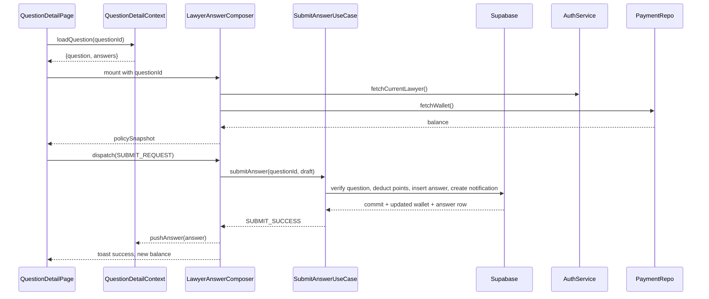

# 07. 변호사 답변 작성 — State Design

## Scope & References
- **Docs**: `docs/userflow.md` #7, `docs/usecases/07-lawyer-answer-submission/spec.md`, `docs/database.md` (answers, point_wallets, notifications).
- **Page**: `/qna/{questionId}` when `role=lawyer`. `QuestionDetailContext` provides shared question/answers state; `LawyerAnswerComposerContext` (nested) manages editor + submission workflow using `useReducer`.

## Managed State Inventory
### Shared Question Detail (imported)
`QuestionDetailContext` (used also by UC-08/09) exposes:
- `question`: { id, title, status, createdAt, isPublic, askerId }
- `answers`: `AnswerSummary[]`
- `policy`: `{ canDelete, canAdopt, remainingDeleteSeconds }`
- `meta`: `{ unreadNotifications, lastFetchedAt }`

### Lawyer Composer Reducer Shape (`AnswerComposerState`)
| key | type | description |
| --- | --- | --- |
| `draft` | `{ content: string; length: number }` | markdown/텍스트 에디터 내용 및 길이.
| `editorMode` | `'write' \| 'preview'` | 에디터 탭 전환 상태.
| `validationErrors` | `{ content?: string }` | 최소 글자수(>200) 미만 시 메시지.
| `policySnapshot` | `{ verificationStatus: 'approved' \| 'pending'; balance: number }` | Context mount 시 `useAuth` + wallet fetch 결과.
| `submitStatus` | `'idle' \| 'validating' \| 'submitting' \| 'success' \| 'error'` | CTA 버튼/폼 disable.
| `deductionPreview` | `{ amount: 1000, currency: 'P' }` | 차감 정보. 상수지만 다른 통화 도입 대비 slice로 둠.
| `serverError` | `string \| null`
| `toast` | `{ type:'success'|'error'; message } \| null`

### Display-only / Derived Data
- 포인트 배지 색상, 입력 카운터 → `draft.length` 기반 계산.
- 잔액 부족 경고 = derived: `policySnapshot.balance < deductionPreview.amount`.
- 제출 가능 여부 = `draft.length >= 200 && submitStatus==='idle' && policySnapshot.verificationStatus==='approved'` (selector).

## State Transition Table
| State slice | Action | Condition | View impact |
| --- | --- | --- | --- |
| `draft` | `UPDATE_DRAFT(text)` | length cap 5,000자 | 에디터 값/카운터 업데이트, 에러 초기화.
| `editorMode` | `SWITCH_MODE(mode)` | toggle | Preview pane 렌더링.
| `validationErrors` | `VALIDATION_FAILED('content')` | length < 200 | 에러 helper text, editor border red.
| `submitStatus` | `SUBMIT_REQUEST` | guard: `canSubmit` selector true | CTA spinner, form disable.
| `submitStatus` & `serverError` | `SUBMIT_FAILURE({ message })` | API error | show toast error, CTA reset.
| `submitStatus` & `toast` & `answers` | `SUBMIT_SUCCESS({ answer })` | API success | Answer list prepend via `QuestionDetailContext`, toast success, draft reset, wallet refresh triggered.
| `policySnapshot.balance` | `WALLET_REFRESH_SUCCESS(balance)` | after UC-07 commit returns new balance | 포인트 배지 업데이트.
| `toast` | `CLEAR_TOAST` | after timeout | hide snackbar.

## Flux Flow
```mermaid
flowchart LR
  Editor -->|UPDATE_DRAFT| Store((AnswerComposerReducer))
  Store --> Editor
  Editor -->|SUBMIT_REQUEST| Store --> AnswerUseCase[SubmitAnswer UC-07]\n(`/api/qna/{id}/answers`)
  AnswerUseCase --> WalletRepo[PointTx + Wallet update]
  WalletRepo --> Store
  AnswerUseCase --> QDetailStore[[QuestionDetailContext]]
  QDetailStore --> AnswersList
  Store --> Toast
```

## Context Loading & Exposure
### Flow


### Exposed Interface (`useLawyerAnswerComposer`)
- State selectors: `draft`, `editorMode`, `submitStatus`, `validationErrors`, `policySnapshot`, `deductionPreview`, `serverError`
- Actions:
  - `updateDraft(text)`
  - `switchMode(mode)`
  - `submit()`
  - `refreshWallet()` (manual retry)
  - `clearToast()`

> **Reuse note**: `QuestionDetailContext` centralizes question/answers/policies so UC-07/08/09 consume the same store, avoiding duplicated fetch or contradictory UI states.
