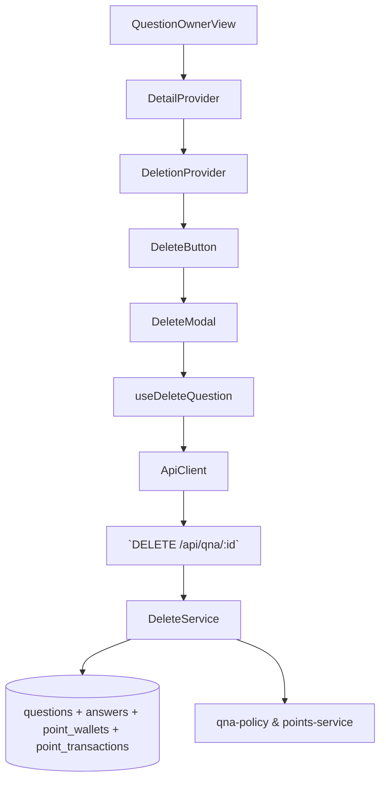

# 08. 질문 삭제(1시간 이내) — Implementation Plan

## Overview
- **QuestionDeletionContext (`src/features/qna-detail/context/question-deletion-context.tsx`)**: 질문 삭제 가능 여부, 카운트다운, 모달 상태, 환불 미리보기, 에러를 추적.
- **useDeleteQuestion Hook (`src/features/qna-detail/hooks/use-delete-question.ts`)**: `/api/qna/{questionId}` DELETE 요청과 성공 후 라우팅을 캡슐화.
- **Deletion UI Components (`src/features/qna-detail/components/{question-actions,delete-modal,refund-preview}.tsx`)**: 삭제 버튼, 확인 모달, 환불 정보 UI.
- **Backend Delete Route & Service (`src/features/qna-detail/backend/delete-{schema,service}.ts`)**: 작성자 검증, 정책 검사, 답변 환불, 소프트 삭제.

## Diagram

## Implementation Plan
### 1. QuestionDeletionContext
1. Provider는 `QuestionDetailContext`에서 제공하는 policy (`canDelete`, `remainingDeleteSeconds`, `refundableAnswerCount`)와 answers를 구독.
2. Reducer(`question-deletion-reducer.ts`) 액션: `OPEN_MODAL`, `CLOSE_MODAL`, `TICK`, `DELETE_REQUEST`, `DELETE_SUCCESS`, `DELETE_FAILURE`, `UPDATE_REFUND_PREVIEW`, `CLEAR_ERROR`.
3. `useInterval`(`react-use`)를 사용해 `TICK` dispatch → `remainingSeconds`가 0이 되면 `canDelete=false`.
- **단위 테스트**: Reducer 테스트에서 (a) `TICK`이 0에서 멈추는지, (b) `DELETE_SUCCESS`가 상태를 reset하는지 검증. 실패 케이스부터 작성.
- **충돌 검토**: Context가 QuestionDetailContext 위에 얹히므로 네임스페이스 중복 없음.

### 2. useDeleteQuestion Hook
1. Hook은 `useMutation`으로 `/api/qna/${questionId}` DELETE 호출. 성공 시 `router.replace('/lawyer-board')`와 toast를 표시, `QuestionDetailContext`에 `MARK_DELETED` dispatch.
2. `refundPreview`를 요청 body로 전달해 서버와 금액을 맞춰 교차검증. 서버 응답에서 실제 환불 내역을 반환해 UI에 표시.
3. 에러 코드(`WINDOW_EXPIRED`, `NOT_OWNER`)에 따라 메시지를 다르게 표시.
- **단위 테스트**: helper `deleteQuestion`를 Vitest로 테스트 (시간 초과, 성공). Hook은 `renderHook`으로 happy path 검증.
- **충돌 검토**: DELETE endpoint 신규. 기존 질문 API 없음.

### 3. Deletion UI Components
1. `question-actions.tsx`: 작성자에게만 삭제 버튼을 노출하고 countdown chip을 표시.
2. `delete-modal.tsx`: 환불 요약(답변 수 × 1,000P), 경고 문구, 비가역성 확인 체크박스를 포함. CTA는 `deleteStatus`에 따라 spinner 표시.
3. `refund-preview.tsx`: 각 답변 작성자에게 환불되는 포인트 목록을 렌더.
- **QA 시트**:
  | 시나리오 | 절차 | 기대 결과 |
  | --- | --- | --- |
  | 시간 초과 | `remainingSeconds=0` 상태 | 버튼 disabled, tooltip "1시간 이내만 삭제" |
  | 환불 안내 | 답변 3개 상태에서 모달 열기 | 총 환불액 3,000P 표시 |
  | 삭제 성공 | confirm & submit | 모달 닫힘, toast + `/lawyer-board` redirect |
  | 서버 에러 | API 500 | 모달 내 에러 배너 표시, CTA 재활성화 |
- **충돌 검토**: UI는 질문 상세 페이지에만 존재, 다른 페이지에 영향 없음.

### 4. Backend Delete Route & Service
1. `schema.ts`: `DeleteQuestionParamsSchema`(questionId)와 `DeleteQuestionResponseSchema`(refunded answers, redirect path) 정의.
2. `service.ts`: 
   - 질문 + 답변 조회 후 `evaluateQuestionDeletion`으로 검증.
   - 각 답변에 대해 `refundForAnswerDeletion` 호출 → 누적 트랜잭션 생성.
   - Supabase 트랜잭션: `point_transactions` bulk insert, `point_wallets` update, `answers.deleted_at`, `questions.deleted_at/status='deleted'` 설정.
3. `route.ts`: `app.delete('/api/qna/:questionId', ...)` 등록. 실패 사유에 따라 403/409/500 구분.
- **단위 테스트**: service 테스트에서 (a) 성공 환불, (b) TIME WINDOW 만료, (c) point wallet update 실패 rollback. 테스트 순서는 Red → Green → Refactor.
- **충돌 검토**: 기존 도메인 서비스(`points-service`) 재사용. 새 route만 추가.

### 테스트 & E2E 전략
- **Unit**: deletion reducer, delete helper, backend service. 모든 테스트는 `docs/rules/tdd.md` 언급.
- **E2E**: `tests/e2e/question-delete.spec.ts`
  1. 질문자 계정으로 `/qna/{id}` 접근.
  2. 남은 시간이 1시간 내일 때 삭제 버튼 노출 및 성공 후 게시판 redirect 확인.
  3. 1시간 경과 시 버튼 비활성화 + 경고 표시.
- **Monitoring**: 삭제 성공 시 React Query 캐시에서 해당 질문 키를 제거하여 stale 데이터 방지.
