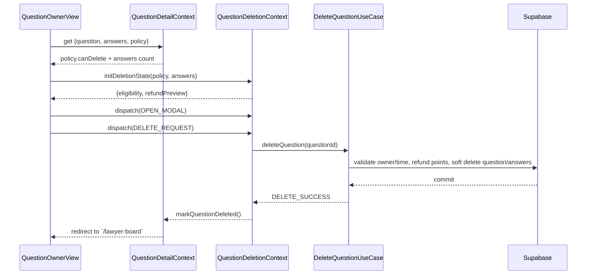

# 08. 질문 삭제(1시간 이내) — State Design

## Scope & References
- **Docs**: `docs/userflow.md` #8, `docs/usecases/08-question-delete-within-1h/spec.md`, `docs/database.md` (questions.status, answers.deleted_at, point_transactions).
- **Page**: `/qna/{questionId}` for 질문 작성자 또는 `/my-page` 질문 목록. Shares `QuestionDetailContext`; adds `QuestionDeletionContext` for owner-only controls.

## Managed State Inventory
### Deletion Reducer Shape (`QuestionDeletionState`)
| key | type | description |
| --- | --- | --- |
| `eligibility` | `{ remainingSeconds: number; isOwner: boolean; canDelete: boolean }` | Derived from `QuestionDetailContext.policy`. Reducer stores countdown for UI.
| `confirmModal` | `{ open: boolean; step: 'warning' \| 'processing' }` | 모달 표시.
| `deleteStatus` | `'idle' \| 'submitting' \ | 'success' \| 'error'` | API 호출 상태.
| `refundPreview` | `{ answerCount: number; totalRefund: number }` | answers length × 1000. Updates as answers change.
| `error` | `string \| null`

### Display-only / Derived Data
- 카운트다운 배지 텍스트 = `formatDuration(eligibility.remainingSeconds)` (no extra state).
- 버튼 disable 조건 = `!eligibility.canDelete || deleteStatus === 'submitting'` (selector).

## State Transition Table
| State slice | Action | Condition | UI impact |
| --- | --- | --- | --- |
| `eligibility.remainingSeconds` | `TICK()` | interval while `canDelete` | Countdown badge shrink, auto-disable when 0.
| `confirmModal` | `OPEN_MODAL` | guard: `eligibility.canDelete` | 모달 표시 + 환불 안내.
| same | `CLOSE_MODAL` | any | 모달 닫기, step reset.
| `deleteStatus` & `confirmModal.step` | `DELETE_REQUEST` | triggered by confirm CTA | step='processing', spinner, disable actions.
| same | `DELETE_SUCCESS` | API success | `deleteStatus='success'`, modal close, `QuestionDetailContext` updates question status→`deleted`, redirect to `/lawyer-board` triggered.
| same | `DELETE_FAILURE({ message })` | error | step='warning', `deleteStatus='error'`, error banner.
| `refundPreview` | `UPDATE_REFUND_PREVIEW(answerCount)` | whenever answers array changes | Modal text update (환불 총액 표기).
| `error` | `CLEAR_ERROR` | after toast | hide message.

## Flux Flow
```mermaid
flowchart LR
  OwnerButton[Delete Button]
  Store((QuestionDeletionReducer))
  Modal[Confirm Modal]
  UseCase[DeleteQuestion UC-08]
  DB[(Supabase)]
  QCtx[[QuestionDetailContext]]

  OwnerButton -->|OPEN_MODAL| Store --> Modal
  Modal -->|DELETE_REQUEST| Store --> UseCase --> DB --> UseCase
  UseCase --> Store: DELETE_SUCCESS/FAILURE
  Store --> QCtx: update question status, answers deleted
  QCtx --> PageRouter
```

## Context Loading & Exposure
### Flow


### Exposed Interface (`useQuestionDeletion`)
- `eligibility` (includes `remainingSeconds`, `canDelete`)
- `refundPreview`
- `confirmModal`, `deleteStatus`, `error`
- Actions:
  - `openModal()` / `closeModal()`
  - `startDelete()`
  - `tick()` (hooked via `useInterval`)
  - `clearError()`

> **Integration**: `QuestionDeletionContext` subscribes to `QuestionDetailContext.answers` so refunds stay accurate when 새로운 답변이 추가되거나 삭제된다.
