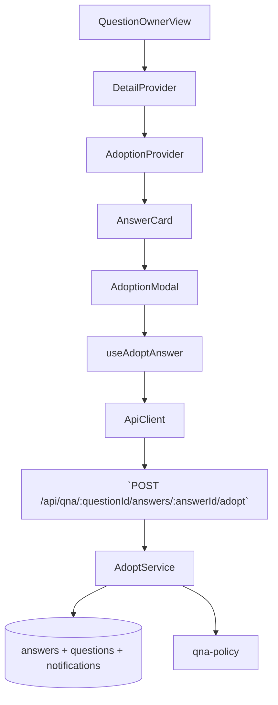

# 09. 답변 채택 — Implementation Plan

## Overview
- **AnswerAdoptionContext (`src/features/qna-detail/context/answer-adoption-context.tsx`)**: 질문자 채택 가능 여부, 선택된 답변, 모달, 진행 상태를 관리 (QuestionDetailContext 의존).
- **useAdoptAnswer Hook (`src/features/qna-detail/hooks/use-adopt-answer.ts`)**: `/api/qna/{questionId}/answers/{answerId}/adopt` 호출과 성공 후 상태 업데이트를 캡슐화.
- **Adoption UI Components (`src/features/qna-detail/components/{adoption-button,adoption-modal,adopted-badge}.tsx`)**: 답변 카드 내 채택 버튼, 확인 모달, 채택 배지/정렬 처리.
- **Backend Adoption Route & Service (`src/features/qna-detail/backend/adopt-{schema,service}.ts`)**: 작성자 확인, 기존 채택 여부 검증, 답변/질문 상태 업데이트, 알림 생성.

## Diagram

## Implementation Plan
### 1. AnswerAdoptionContext
1. Provider는 `QuestionDetailContext`에서 owner 여부, 이미 채택된 답변 ID, 질문 상태를 받아 initial state를 설정.
2. Reducer(`answer-adoption-reducer.ts`) 액션: `OPEN_CONFIRM`, `CLOSE_CONFIRM`, `ADOPT_REQUEST`, `ADOPT_SUCCESS`, `ADOPT_FAILURE`, `CLEAR_TOAST`.
3. Success 시 `QuestionDetailContext`에 `UPDATE_ANSWER_STATUS`와 `UPDATE_POLICY`를 dispatch하여 전역 상태 동기화.
- **단위 테스트**: Reducer 테스트 (예: `ADOPT_SUCCESS`가 `eligible.hasAdopted`를 true로 설정하고 모달 닫는지). 실패 케이스부터 작성.
- **충돌 검토**: Context는 질문자에게만 마운트되고 네임스페이스 고유.

### 2. useAdoptAnswer Hook
1. Hook은 `useMutation`을 사용해 `/api/qna/${questionId}/answers/${answerId}/adopt` POST.
2. 성공 시 응답의 채택된 answerId를 Context와 `QuestionDetailContext`에 반영, toast success.
3. 에러 코드(`ALREADY_ADOPTED`, `NOT_OWNER`, `ANSWER_NOT_FOUND`)에 따라 사용자 메시지를 분기.
- **단위 테스트**: helper `postAdoptAnswer`를 Vitest로 테스트 (이미 채택된 경우 409). Hook은 `renderHook`으로 success 케이스 검증.
- **충돌 검토**: Endpoint 신규, 기존 코드와 경로 충돌 없음.

### 3. Adoption UI Components
1. `adoption-button.tsx`: `eligible` 상태에 따라 버튼 disable, tooltip copy 제공. 클릭 시 `openConfirm(answer.id)`.
2. `adoption-modal.tsx`: 선택된 답변 요약, 확인 CTA, `adoptStatus`에 따른 spinner. 성공 시 자동으로 닫히며 toast.
3. `adopted-badge.tsx`: 채택된 답변에 배치, 리스트 정렬은 `QuestionDetailContext`에서 `answers`를 재정렬하여 구현.
- **QA 시트**:
  | 시나리오 | 절차 | 기대 결과 |
  | --- | --- | --- |
  | 채택 버튼 숨김 | 질문자가 아님 | 버튼 미표시 |
  | 채택 중 모달 취소 | confirm modal에서 취소 | 모달 닫히고 상태 초기화 |
  | 채택 성공 | 질문자 → 채택 버튼 클릭 | 답변 카드에 배지 추가, 다른 채택 버튼 비활성화 |
  | 이미 채택된 답변 존재 | 두 번째 답변에서 채택 | 에러 토스트 "이미 채택됨" |
- **충돌 검토**: UI 컴포넌트 고유 파일명, 기존 답변 카드와 통합 예정이라 충돌 없음.

### 4. Backend Adoption Route & Service
1. `schema.ts`: `AdoptAnswerParamsSchema`(questionId, answerId)와 응답 스키마 정의.
2. `service.ts`: 
   - 질문/답변 조회 후 `canAdoptAnswer` 호출.
   - 트랜잭션으로 `answers.status='adopted'`, `answers.adopted_at=now`, `questions.status='adopted'`, `notifications` insert.
3. `route.ts`: `app.post('/api/qna/:questionId/answers/:answerId/adopt', ...)` 등록. 실패 사유별 status(403/409/404/500)를 매핑.
- **단위 테스트**: service 테스트 시나리오 (happy path, already adopted, not owner). TDD로 실패 테스트부터 작성.
- **충돌 검토**: 새 route가 기존과 겹치지 않음. Domain 정책(`qna-policy`) 재사용으로 DRY 유지.

### 테스트 & E2E 전략
- **Unit**: adoption reducer, adopt helper, backend service. 각 테스트는 `docs/rules/tdd.md` 준수.
- **E2E**: `tests/e2e/answer-adoption.spec.ts`
  1. 질문자로 로그인 → `/qna/{id}` 진입.
  2. 채택 버튼 클릭 → 확인 모달 → 성공 시 배지 확인 & 질문 상태 "채택 완료" 표시.
  3. 이미 채택된 질문에서 버튼이 숨겨지는지 검증.
- **Integration**: Playwright에서 변호사 알림이 생성됐는지 확인(알림 리스트 stub).
