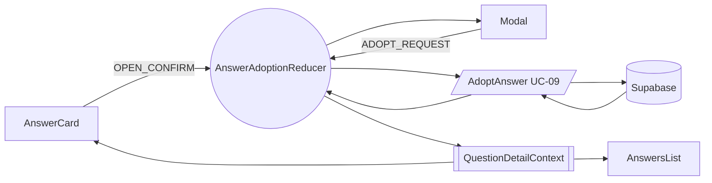
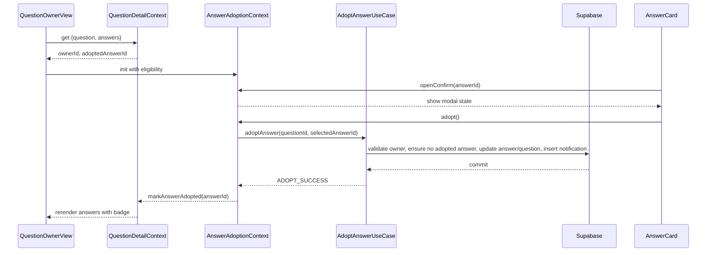

# 09. 답변 채택 — State Design

## Scope & References
- **Docs**: `docs/userflow.md` #9, `docs/usecases/09-answer-adoption/spec.md`, `docs/database.md` (answers.status, notifications).
- **Page**: `/qna/{questionId}` for 질문 작성자. Shares `QuestionDetailContext`; `AnswerAdoptionContext` handles owner-specific controls.

## Managed State Inventory
### Reducer Shape (`AnswerAdoptionState`)
| key | type | description |
| --- | --- | --- |
| `eligible` | `{ isOwner: boolean; hasAdopted: boolean; questionStatus: 'awaiting_answer' \| 'adopted' \| 'deleted' }` | Snapshot from `QuestionDetailContext`.
| `selectedAnswerId` | `string \| null` | 현재 채택 버튼 클릭 대상.
| `adoptStatus` | `'idle' \| 'confirming' \| 'submitting' \| 'success' \| 'error'` | CTA 상태.
| `confirmModalOpen` | `boolean` | 채택 확인 모달 표시.
| `serverError` | `string \| null`
| `toast` | `{ type:'success'|'error'; message } \| null`

### Display-only / Derived Data
- 답변 카드별 채택 버튼 disable = derived: `!eligible.isOwner || eligible.hasAdopted || answer.status==='adopted'`.
- 하이라이트 여부 = `answer.id === adoptedAnswerId` (from `QuestionDetailContext`).

## State Transition Table
| State slice | Action | Condition | View impact |
| --- | --- | --- | --- |
| `selectedAnswerId` & `confirmModalOpen` | `OPEN_CONFIRM(answerId)` | guard: `eligible.isOwner && !eligible.hasAdopted` | 모달 open, 채택 대상 표시.
| `confirmModalOpen` | `CLOSE_CONFIRM` | any | 모달 close.
| `adoptStatus` | `ADOPT_REQUEST` | guard: `selectedAnswerId` truthy | 모달 CTA 스피너, 전체 채택 버튼 disable.
| `adoptStatus` & `toast` & `eligible.hasAdopted` | `ADOPT_SUCCESS({ answerId })` | API success | 모달 close, toast success, `eligible.hasAdopted=true`, `QuestionDetailContext` 업데이트(답변 status='adopted', 질문 status='adopted'), 채택 배지 표시.
| `serverError` & `adoptStatus` | `ADOPT_FAILURE({ message })` | API error | 에러 배너, `adoptStatus='error'`, 버튼 재활성화.
| `toast` | `CLEAR_TOAST` | after delay | Snackbar hide.

## Flux Flow

## Context Loading & Exposure
### Flow

### Exposed Interface (`useAnswerAdoption`)
- Selectors: `eligible`, `selectedAnswerId`, `adoptStatus`, `confirmModalOpen`, `serverError`
- Actions:
  - `openConfirm(answerId)`
  - `closeConfirm()`
  - `adopt()`
  - `clearToast()`

> **Coordination**: `AnswerAdoptionContext` listens to `QuestionDetailContext` updates so that if 다른 기기에서 채택이 완료되면 `eligible.hasAdopted`가 즉시 true로 바뀌며 버튼이 비활성화된다.
